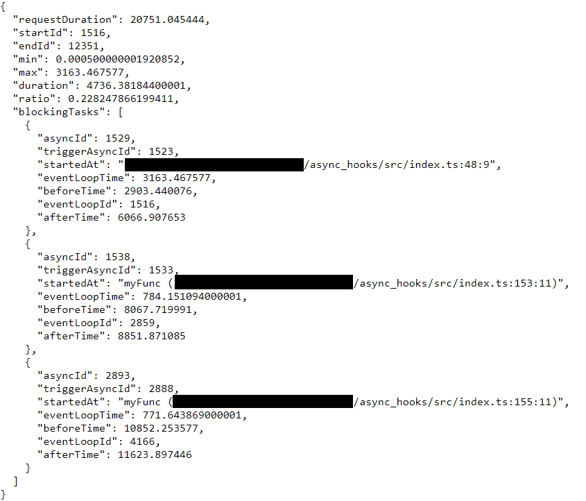

# async_hooks

Playground with async_hooks to detect eventloop blocking tasks and display some stats.

* `http://localhost:3000/`: route to run the diagnostic tool and see the request stats.
  * `requestDuration`: total duration of the request
  * `ratio`: eventloop time / total duration
  * `min`: the minimun eventloop time of request async tasks
  * `max`: the maximum eventloop time of request async tasks
  * `duration`: the eventloop time of the request
  * `startId`: the id of the eventloop at the start of the request
  * `endId`: the id of the eventloop at the end of the request
  * `blockingTasks`: the information about blocking tasks in the request (ordered by duration)
* `http://localhost:3000/slow`: route to test long running async http call.

## Install
`npm i`

## Build
`npm run build`

## Start
`npm run start`
`npm run start:prod`

## Clean
`npm run clean`
